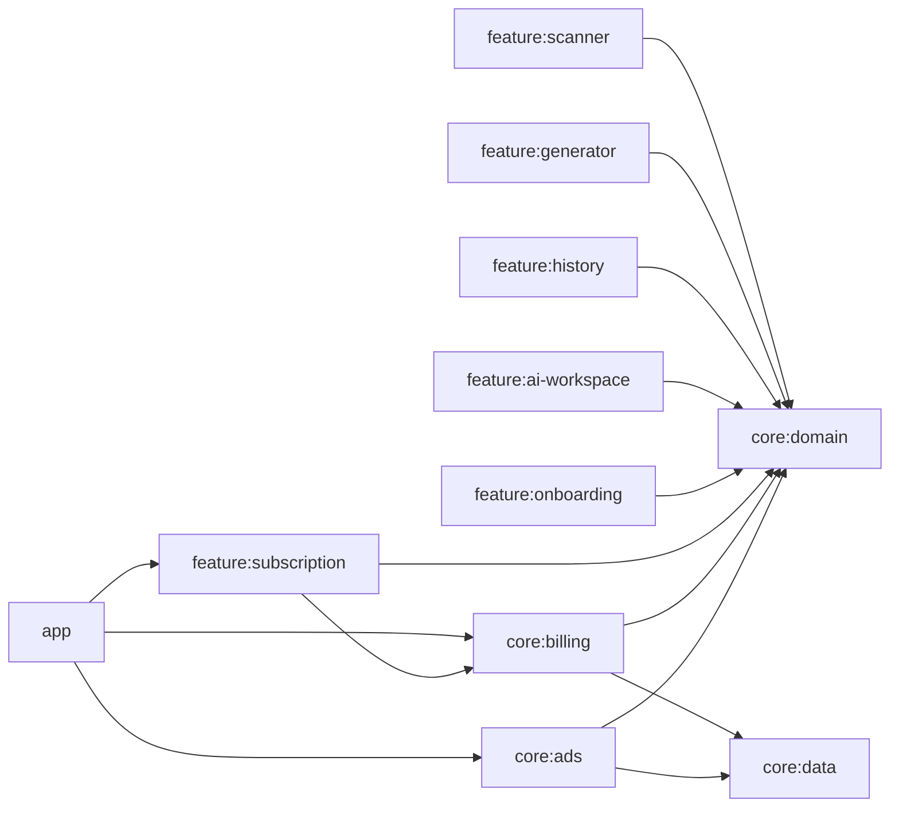
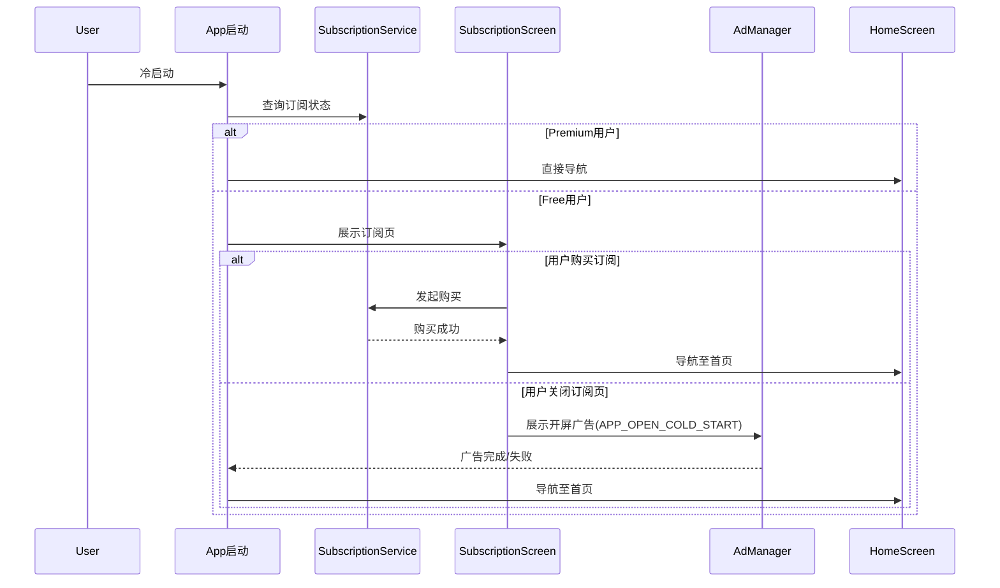
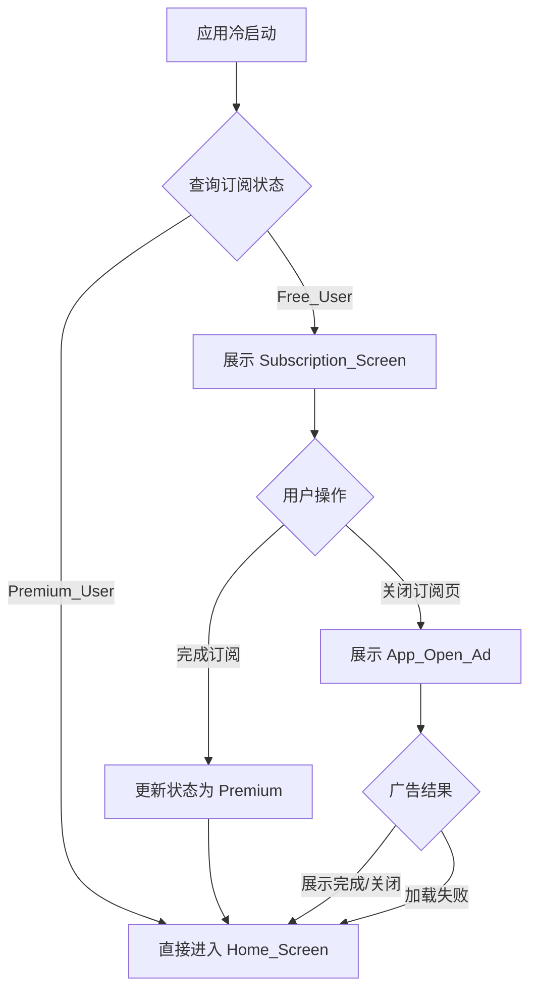
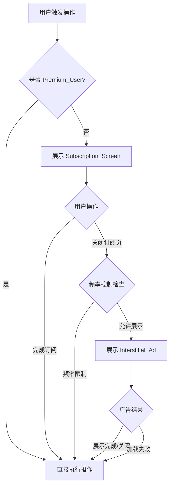
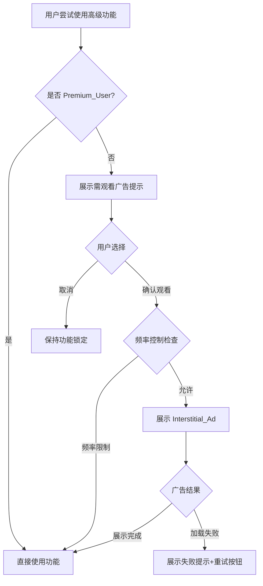

# 技术设计文档：会员体系与广告体系

## Overview

本设计为 QRScanFast Android 应用实现会员订阅体系和广告变现体系提供完整技术方案。系统通过 Google Play Billing Library 实现订阅管理，通过 Google AdMob SDK 实现广告展示。

核心设计原则：
- **模块化**：新增 `core:billing` 和 `core:ads` 独立模块，职责分离
- **广告 ID 场景细分**：每个广告使用场景独立配置广告单元 ID，便于 AdMob 后台数据分析和收入归因
- **响应式状态管理**：订阅状态通过 StateFlow 响应式传播，UI 层自动适配
- **优雅降级**：广告加载失败不阻塞用户正常操作流程

## Architecture

### 模块依赖关系



### 新增模块说明

| 模块 | 职责 |
|------|------|
| `core:billing` | 封装 Google Play Billing Library，管理订阅购买、验证、状态查询和恢复购买 |
| `core:ads` | 封装 Google AdMob SDK，管理广告加载、展示、频率控制和场景化广告 ID 配置 |
| `feature:subscription` | 订阅页面 UI（展示方案列表、购买交互、恢复购买） |

### 架构决策

1. **billing 和 ads 分离**：订阅逻辑和广告逻辑职责不同，独立模块便于维护和测试
2. **ads 依赖 domain 获取用户状态**：广告展示决策需要查询订阅状态（会员跳过广告）
3. **feature 模块通过 domain 接口解耦**：各 feature 依赖 `core:domain` 中的抽象接口

### 启动流程序列图



## Components and Interfaces

### 1. core:billing 模块

#### SubscriptionRepository（接口定义在 core:domain）

```kotlin
interface SubscriptionRepository {
    val subscriptionState: StateFlow<SubscriptionState>
    val isPremium: StateFlow<Boolean>
    suspend fun queryPurchases(): Result<SubscriptionState>
    suspend fun launchPurchaseFlow(activity: Activity, plan: SubscriptionPlan): Result<PurchaseResult>
    suspend fun restorePurchases(): Result<SubscriptionState>
}
```

#### SubscriptionStateManager（core:billing 实现）

```kotlin
@Singleton
class SubscriptionStateManager @Inject constructor(
    private val billingClient: PlayBillingClientWrapper,
    private val preferences: SubscriptionPreferences
) {
    private val _state = MutableStateFlow<SubscriptionState>(SubscriptionState.Loading)
    val state: StateFlow<SubscriptionState> = _state.asStateFlow()

    suspend fun refreshState() { /* 查询 Google Play 并更新 */ }
    suspend fun onPurchaseCompleted(purchase: Purchase) { /* 购买成功更新 */ }
    suspend fun onSubscriptionExpired() { /* 过期回退 */ }
}
```

### 2. core:ads 模块

#### AdPlacement — 广告场景枚举（每个场景独立广告单元 ID）

```kotlin
enum class AdPlacement(
    val adUnitId: String,
    val type: AdType,
    val scene: String
) {
    // 开屏广告
    APP_OPEN_COLD_START(BuildConfig.AD_OPEN_COLD_START, AdType.APP_OPEN, "cold_start"),
    // 插屏广告 - 按场景细分
    INTERSTITIAL_SCAN(BuildConfig.AD_INTERSTITIAL_SCAN, AdType.INTERSTITIAL, "scan"),
    INTERSTITIAL_GENERATE(BuildConfig.AD_INTERSTITIAL_GENERATE, AdType.INTERSTITIAL, "generate"),
    INTERSTITIAL_AI_BEAUTIFY(BuildConfig.AD_INTERSTITIAL_AI_BEAUTIFY, AdType.INTERSTITIAL, "ai_beautify"),
    INTERSTITIAL_ADVANCED_UNLOCK(BuildConfig.AD_INTERSTITIAL_ADVANCED_UNLOCK, AdType.INTERSTITIAL, "advanced_unlock"),
    // 原生卡片广告 - 按场景细分
    NATIVE_ONBOARDING(BuildConfig.AD_NATIVE_ONBOARDING, AdType.NATIVE, "onboarding"),
    NATIVE_HOME_TAB(BuildConfig.AD_NATIVE_HOME_TAB, AdType.NATIVE, "home_tab"),
    NATIVE_HISTORY_LIST(BuildConfig.AD_NATIVE_HISTORY_LIST, AdType.NATIVE, "history_list"),
    NATIVE_SCAN_RESULT_DETAIL(BuildConfig.AD_NATIVE_SCAN_RESULT_DETAIL, AdType.NATIVE, "scan_result_detail")
}

enum class AdType { APP_OPEN, INTERSTITIAL, NATIVE }
```

#### AdManager 接口

```kotlin
interface AdManager {
    fun shouldShowAd(placement: AdPlacement): Boolean
    suspend fun preload(placement: AdPlacement)
    suspend fun showFullScreenAd(activity: Activity, placement: AdPlacement): AdShowResult
    fun getNativeAdState(placement: AdPlacement): StateFlow<NativeAdState>
}

sealed interface AdShowResult {
    data object Shown : AdShowResult
    data object LoadFailed : AdShowResult
    data object FrequencyLimited : AdShowResult
    data object PremiumUser : AdShowResult
}

sealed interface NativeAdState {
    data object Loading : NativeAdState
    data class Loaded(val nativeAd: Any) : NativeAdState
    data object Failed : NativeAdState
    data object Hidden : NativeAdState
}
```

#### FrequencyController — 广告频率控制

```kotlin
interface FrequencyController {
    fun canShowInterstitial(): Boolean
    fun isWithinSessionLimit(): Boolean
    fun recordInterstitialShow()
    fun resetSession()
}

@Singleton
class FrequencyControllerImpl @Inject constructor(
    private val clock: Clock
) : FrequencyController {
    private var lastShowTimeMs: Long = 0L
    private var sessionCount: Int = 0

    companion object {
        const val MIN_INTERVAL_MS = 60_000L
        const val MAX_PER_SESSION = 10
    }

    override fun canShowInterstitial(): Boolean {
        val elapsed = clock.currentTimeMillis() - lastShowTimeMs
        return elapsed >= MIN_INTERVAL_MS && sessionCount < MAX_PER_SESSION
    }
    override fun isWithinSessionLimit() = sessionCount < MAX_PER_SESSION
    override fun recordInterstitialShow() {
        lastShowTimeMs = clock.currentTimeMillis()
        sessionCount++
    }
    override fun resetSession() { sessionCount = 0 }
}
```

#### AdGatekeeper — 广告拦截协调器

```kotlin
class AdGatekeeper @Inject constructor(
    private val adManager: AdManager,
    private val subscriptionRepository: SubscriptionRepository,
    private val frequencyController: FrequencyController
) {
    suspend fun gate(activity: Activity, placement: AdPlacement): GateResult
}

sealed class GateResult {
    data object Proceed : GateResult()
    data object SubscriptionPurchased : GateResult()
}
```

### 3. feature:subscription 模块（新增）

```kotlin
@Composable
fun SubscriptionScreen(
    onDismiss: () -> Unit,
    onPurchaseSuccess: () -> Unit,
    viewModel: SubscriptionViewModel = hiltViewModel()
)

@HiltViewModel
class SubscriptionViewModel @Inject constructor(
    private val subscriptionRepository: SubscriptionRepository
) : ViewModel() {
    val plans: StateFlow<List<SubscriptionPlanUiModel>>
    val purchaseState: StateFlow<PurchaseUiState>
    fun selectPlan(plan: SubscriptionPlan) { /* ... */ }
    fun confirmPurchase(activity: Activity) { /* ... */ }
    fun restorePurchases() { /* ... */ }
}
```

### 4. 列表广告插入工具

```kotlin
object ListAdInserter {
    fun <T> insertAds(items: List<T>, interval: Int = 5): List<ListItem<T>>
}

sealed class ListItem<out T> {
    data class Content<T>(val data: T) : ListItem<T>()
    data object AdSlot : ListItem<Nothing>()
}
```

### 5. StartupOrchestrator — 启动编排

```kotlin
@Singleton
class StartupOrchestrator @Inject constructor(
    private val subscriptionRepository: SubscriptionRepository,
    private val adManager: AdManager
) {
    val startupState: StateFlow<StartupState>
    suspend fun orchestrate(activity: Activity)
}

sealed class StartupState {
    data object Loading : StartupState()
    data object ShowSubscription : StartupState()
    data object ShowAppOpenAd : StartupState()
    data object NavigateToHome : StartupState()
}
```

## Data Models

### 订阅相关模型

```kotlin
sealed class SubscriptionState {
    data object Loading : SubscriptionState()
    data object Free : SubscriptionState()
    data class Premium(val plan: SubscriptionPlan, val expiryTime: Instant?) : SubscriptionState()
}

enum class SubscriptionPlan(
    val productId: String,
    val basePlanId: String?,
    val offerId: String?,
    val isOneTime: Boolean = false
) {
    TRIAL("qrscanfast_premium_weekly", "weekly-base", "trial-3day"),
    WEEKLY("qrscanfast_premium_weekly", "weekly-base", null),
    ANNUAL("qrscanfast_premium_annual", "annual-base", null),
    LIFETIME("qrscanfast_premium_lifetime", null, null, isOneTime = true)
}

sealed class PurchaseResult {
    data class Success(val plan: SubscriptionPlan) : PurchaseResult()
    data object Cancelled : PurchaseResult()
    data class Error(val code: Int, val message: String) : PurchaseResult()
}
```

### 广告单元 ID 场景配置表

| 广告类型 | 场景名称 | 枚举值 | 用途说明 |
|---------|---------|--------|---------|
| 开屏 | 首次冷启动 | `APP_OPEN_COLD_START` | 用户关闭订阅页后展示 |
| 插屏 | 扫描结果 | `INTERSTITIAL_SCAN` | 获取扫描结果时触发 |
| 插屏 | 生成二维码/条码 | `INTERSTITIAL_GENERATE` | 生成操作时触发 |
| 插屏 | AI美化 | `INTERSTITIAL_AI_BEAUTIFY` | 进入 AI 美化页面前触发 |
| 插屏 | 高级功能解锁 | `INTERSTITIAL_ADVANCED_UNLOCK` | 用户确认观看广告后触发 |
| 原生 | 新手引导 | `NATIVE_ONBOARDING` | 引导页中嵌入卡片广告 |
| 原生 | 首页Tab栏 | `NATIVE_HOME_TAB` | Tab栏上方 80dp 卡片 |
| 原生 | 历史记录列表 | `NATIVE_HISTORY_LIST` | 列表每隔 N 条插入 |
| 原生 | 扫描结果详情 | `NATIVE_SCAN_RESULT_DETAIL` | 详情页内容区域展示 |

### 订阅方案 Product ID 配置表

| 方案 | Product ID | 类型 | Base Plan | Offer | 价格 |
|------|-----------|------|-----------|-------|------|
| Trial | `qrscanfast_premium_weekly` | subscription | `weekly-base` | `trial-3day` | 3天免费→$6.99/周 |
| Weekly | `qrscanfast_premium_weekly` | subscription | `weekly-base` | — | $6.99/周 |
| Annual | `qrscanfast_premium_annual` | subscription | `annual-base` | — | $16.99/年 |
| Lifetime | `qrscanfast_premium_lifetime` | inapp | — | — | $19.99 一次性 |

### 本地缓存（DataStore）

```kotlin
class SubscriptionPreferences @Inject constructor(private val dataStore: DataStore<Preferences>) {
    val isPremium: Flow<Boolean>
    val activePlan: Flow<String?>
    val expiryTimeMs: Flow<Long?>
    suspend fun updateStatus(isPremium: Boolean, plan: String?, expiryMs: Long?)
}
```

### 流程图

#### 首启流程



#### 广告拦截流程（扫描/生成/AI美化）



#### 高级功能解锁流程



## Correctness Properties

*属性（Property）是一种在系统所有有效执行中都应保持为真的特征或行为——本质上是对系统应做之事的形式化陈述。属性是人类可读需求与机器可验证正确性保证之间的桥梁。*

### Property 1: 订阅方案目录完整性

*For any* 对订阅方案目录的查询，`SubscriptionPlan.values()` 应始终包含恰好 4 个方案（TRIAL、WEEKLY、ANNUAL、LIFETIME），每个方案拥有非空的 productId，且 LIFETIME 的 `isOneTime` 为 true，其余为 false。

**Validates: Requirements 1.1**

### Property 2: 订阅状态机正确性

*For any* 订阅事件（购买确认、过期、取消、恢复购买），状态转换逻辑应产生正确的用户状态——购买确认和有效恢复事件转为 `Premium`（plan 字段与事件对应），过期和取消事件转为 `Free`。

**Validates: Requirements 1.3, 1.4, 12.2**

### Property 3: Premium 用户全局绕过所有限制

*For any* 处于 `Premium` 状态的用户和任意 `AdPlacement`，`shouldShowAd()` 应返回 `false`，`gate()` 应返回 `Proceed`，不加载任何广告。

**Validates: Requirements 2.1, 2.2, 2.3**

### Property 4: 免费用户受控操作拦截

*For any* 处于 `Free` 状态的用户触发的受控操作（扫描、生成、高级功能），拦截决策逻辑应返回"需要拦截"，不允许直接放行。

**Validates: Requirements 6.1, 6.2, 8.1**

### Property 5: 插屏广告频率控制

*For any* 插屏广告展示请求序列，频率控制器应强制：(1) 任意两次允许展示间隔 ≥ 60 秒；(2) 单次会话总展示 ≤ 10 次。违反时返回 `false`。

**Validates: Requirements 10.1, 10.2, 10.3**

### Property 6: 历史列表广告插入位置正确性

*For any* 长度为 N 的列表和间隔 K，`insertAds(items, K)` 应满足：(1) Content 项相对顺序不变；(2) 相邻 AdSlot 间恰有 K 个 Content 项；(3) Content 总数等于 N。

**Validates: Requirements 9.1**

## Error Handling

### 广告加载失败

| 场景 | 处理策略 |
|------|---------|
| 开屏广告加载失败 | 直接导航至首页，不阻塞启动 |
| 插屏广告加载失败（扫描/生成/AI美化） | 跳过广告，继续执行用户原本操作 |
| 插屏广告加载失败（高级功能解锁） | 展示"加载失败"提示，提供重试按钮 |
| 原生广告加载失败 | 隐藏广告区域，不影响页面布局 |

### 计费相关错误

| 场景 | 处理策略 |
|------|---------|
| Google Play 连接失败 | 使用 DataStore 缓存的订阅状态，后台重试连接 |
| 购买流程被用户取消 | 保持订阅页面，不展示错误信息 |
| 购买失败（网络/服务端错误） | 展示错误信息，保持订阅页面可重试 |
| 订阅状态查询失败 | 使用缓存状态，后台定期重试 |
| 恢复购买无结果 | 提示"未找到历史购买记录" |

### 超时配置

- 广告加载超时：10 秒后自动跳过
- BillingClient 连接超时：5 秒后使用缓存状态
- 订阅状态刷新超时：10 秒后使用缓存状态

## Testing Strategy

### 属性测试（Property-Based Testing）

使用 **Kotest Property**（项目已引入 `io.kotest:kotest-property:5.9.1`），每个属性测试最少 **100 次迭代**。

| Property | 被测组件 | 生成器策略 |
|----------|---------|-----------|
| P1: 方案目录完整性 | `SubscriptionPlan` 枚举 | 遍历枚举值验证属性 |
| P2: 状态机正确性 | `SubscriptionStateManager` | `Arb.enum<SubscriptionEvent>()` 随机事件序列 |
| P3: Premium绕过 | `AdManager.shouldShowAd()` | `Arb.enum<AdPlacement>()` × Premium 状态 |
| P4: Free用户拦截 | 拦截决策逻辑 | `Arb.enum<GatedAction>()` × Free 状态 |
| P5: 频率控制 | `FrequencyControllerImpl` | `Arb.long(0..300_000)` 随机时间戳序列 |
| P6: 列表广告插入 | `ListAdInserter` | `Arb.list(Arb.string(), 0..200)` 随机列表 |

标签格式：
```kotlin
// Feature: membership-and-ads, Property {N}: {property_text}
```

### 单元测试

| 模块 | 测试场景 |
|------|---------|
| core:billing | 购买成功状态转换、过期回退、缓存读取 |
| core:ads | 广告加载失败降级、频率控制边界、会员跳过 |
| feature:subscription | 方案列表展示、购买流程 UI 状态机 |
| app (StartupOrchestrator) | 冷启动各分支 |

### 集成测试

| 场景 | 测试内容 |
|------|---------|
| BillingClient | 使用 Google Play Billing Testing Library |
| AdMob | 使用 Google 测试广告单元 ID |
| 端到端 | 冷启动→订阅页→广告→主界面 |

### 测试环境广告 ID 配置

```kotlin
// app/build.gradle.kts
android {
    buildTypes {
        debug {
            buildConfigField("String", "AD_OPEN_COLD_START", "\"ca-app-pub-3940256099942544/9257395921\"")
            buildConfigField("String", "AD_INTERSTITIAL_SCAN", "\"ca-app-pub-3940256099942544/1033173712\"")
            buildConfigField("String", "AD_NATIVE_HOME_TAB", "\"ca-app-pub-3940256099942544/2247696110\"")
            // 其余场景使用对应类型的 Google 官方测试 ID
        }
        release {
            // 从 AdMob 控制台获取的真实广告单元 ID
        }
    }
}
```

### 测试框架

- 单元测试：JUnit 5 + MockK + Coroutines Test + Turbine
- 属性测试：Kotest Property（`checkAll(iterations = 100) { ... }`）
- UI 测试：Compose UI Test
